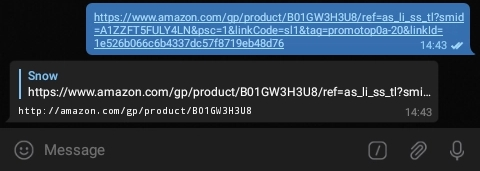
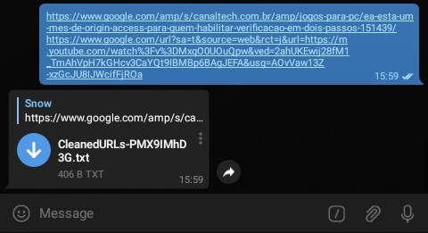

<h2 align='center'>Unalix</h2>

### What is it?

Unalix is a bot developed for Telegram. Its main purpose is to help users remove tracking fields from URLs. This project is based on [ClearURLs](http://gitlab.com/KevinRoebert/ClearUrls), an add-on developed for [Chrome](http://chrome.google.com/webstore/detail/clearurls/lckanjgmijmafbedllaakclkaicjfmnk) and [Firefox](http://addons.mozilla.org/addon/clearurls).

### What it does?

In addition to removing tracking fields from user-submitted URLs, Unalix also try to gets the direct link from shortened URLs. Example: If you send a shortened URL from services like [bit.ly](https://bitly.com) or [goo.gl](http://goo.gl), the bot will return you the URL to which the original link redirects, not the `bit.ly` or `goo.gl` URL.

### Why would this be useful to me?

#### Privacy

It is quite common to share links within Telegram, whether they are conversations with other users or within groups. Most people don't check links before sending them, they just copy and paste. This is the biggest problem.

Links we share may contain tracking parameters related to services such as [Google Analytics](http://en.wikipedia.org/wiki/Google_Analytics) or [Google Ads](http://en.wikipedia.org/wiki/Google_Ads). The sole purpose of these parameters is to track and collect information about our online browsing.

By sharing links like these, we are not only compromising our privacy, but we are also compromising the privacy of users who click on the link sent by us. To avoid this, it is always necessary to check a link before sending them. We must analyze and remove the tracking parameters present in it.

#### It is simple and fast

Analyzing and removing tracking parameters can be a very difficult and complicated task. Depending on the size of the link and/or the number of characters in it, it is not clear which fields are being used for online tracking purposes and which are not.

Unalix has a list of [specific rules](http://github.com/SnwMds/Unalix/tree/master/Rules) that aims to remove these tracking parameters. They can remove all tracking fields without breaking the link.

### How to use?

It is extremely simple to use Unalix. To start using it, [open a chat](http://telegram.me/Unalix_bot) with the bot on Telegram and click "**START**".

From there, send via a message or inside a txt file the links you want to be "clean". Unalix will begin processing your request and within a few seconds (or minutes, depending on the number of links), it will send you the final result.

Unalix is also able to process links from web pages. To do this, submit the URLs using the `/getfromurl` command. Unalix will download the entire contents of these URLs, obtain all the `http`/`https` links and process them in a batch operation.

In order to be able to identify the links contained in the message, txt file or web page, they must be in the following format:

* It must start with `http://` or `https://` (case-insensitive)
* It must have a domain name in Latin (`example.org`) or non-Latin (`президент.рф`) alphabet. Links with emoji domain name (`i❤️.ws`) are also supported.

 

If you want Unalix to process multiple links from a single message, txt file or web page, separate them by a whitespace character (`\s`), tab (`\t`), comma (`,`) or a new line (`\n`).

_**Note**: If you submit more than 1 link, the results will be sent in a txt file._



Note that Unalix can also identify links in forwarded messages and file captions.

### Is the bot safe?

Unalix does not permanently store or collect sent links/messages. All files created temporarily by the bot are automatically deleted after processing the user request.

We do not send spam, advertisements or anything unrelated to the bot's primary purpose to its users.

## Limitations

Unalix has some limitations related to link processing, see them below:

### File size

- Unalix cannot process links from txt files that are larger than 20 MB
   - This is a limitation of the Telegram API itself. Bots cannot download files larger than 20 MB. See the [getFile](https://core.telegram.org/bots/api#getfile) method for more info.

- Unalix will not be able to send the results in a txt file if the final file size exceeds 50 MB
   - This is another limitation of the Telegram API. See the [sendDocument](https://core.telegram.org/bots/api#senddocument) method for more info.
   - If the size limit is exceeded, the file size will be shortened to 50000000 bytes (47 MB, in binary). This will cause some results to be lost.
 - Unalix will download only the first 5 MB (5242880 bytes) of web page content
   - This is a limitation imposed by Unalix. To prevent abuse, the bot will not download more than 5 MB of the content of each URL sent via the `/getfromurl` command. If the total size of a page exceeds 5 MB, the bot will read only the first 5242880 bytes of it. The rest of the content will be ignored.
### Getting direct links from URL shorteners

- Unalix only follows the URLs/paths provided by the ["location" header](http://developer.mozilla.org/en-US/docs/Web/HTTP/Headers/Location)
   - It means that Unalix cannot obtain direct links from URL shorteners that require user interaction (example: clicking a button or resolving CAPTCHA) to redirect or that uses JavaScript code to redirect.

- Requests may get blocked
   - To ensure greater privacy, all Unalix network traffic goes through the Tor network. As a result, sites that uses [Cloudflare](http://cloudflare.com) or other protection services may eventually block the acess of Unalix to the server, which prevents the bot from obtaining the direct link from the shortened URL
 
## For developers

### Dependencies

Unalix is written in bash, so it uses software/dependencies generally available on Unix/Linux systems to work. Below are all the dependencies required to run Unalix:

- `idn`
  -  The idn package is used to convert emoji domain names to valid punycode format (example: convert `i❤️.ws` to `xn--i-7iq.ws`).
- `idn2`
   - The idn2 package is used to convert domain names with non-latin characters to valid punycode format (example: convert `президент.рф` to `xn--d1abbgf6aiiy.xn--p1ai`).
- `xmlstarlet`
   - The xmlstarlet package is used to convert HTML entities to valid text (example: convert `&copy;` to `©`).
 - `vim`
    - The xxd package is used to encode non-UTF-8 characters to valid UTF-8 format (example: convert `Ã` to `%c3%83`).
- `jq`
   - The jq package is used to parse json responses received through the Telegram API.
- `curl`
   - The curl package is used to communicate with the Telegram API and also to access links sent by users.
- `bash`
   - The bash package is the base of Unalix. It interprets and executes all commands contained in scripts.

Unalix can still run without `idn` and `idn2` packages, however Unalix will issue errors when trying to process links that have non-Latin alphabet domain names and/or that have emojis.

The `bash`, `curl`, `vim`, `xmlstarlet` and `jq` packages are indispensable. Unalix cannot run without them.

### Installation

Install all required packages using one of the commands below:

On Debian and Ubuntu systems, install all required packages using `apt`:

```
# apt -y update
# apt -y install 'curl' 'jq' 'vim' 'idn' 'idn2' 'xmlstarlet'
```

On Android, install all required packages through Termux with `pkg`:

```
$ pkg update -y
$ pkg install -y 'curl' 'jq' 'vim' 'libidn2' 'xmlstarlet'
```

_Note that the package `idn` is not available on Termux's repositories._

### Get the source

To get Unalix source code, clone the repository using `git` or download using ` wget`.

Clone using git:

```
$ cd "$HOME"
$ git clone -b 'master' 'https://github.com/SnwMds/Unalix.git'
```

Download with wget and extract all files:

```
$ cd "$HOME"
$ wget 'https://codeload.github.com/SnwMds/Unalix/zip/master' -O 'Unalix.zip'
$ unzip 'Unalix.zip' && rm -f 'Unalix.zip'
$ mv 'Unalix-master' 'Unalix'
```
### Setup the bot

All Unalix-related settings are stored in the `Unalix/Settings/Settings.txt` file. Open it in a text editor and read all commented lines. You will know what to do after that.

### Start the bot

Start the bot with

```
$ bash "$HOME/Unalix/StartUnalix.sh"
```

The process runs in foreground. If you want to stop it, press `CTRL` + `C` on your keyboard.

## Contact

Want to say something? Need some help? [Open a issue](http://github.com/SnwMds/Unalix/issues) or [send a email](http://scr.im/SnwMds).

## License

Unalix in licensed under the [GNU Lesser General Public License v3.0](http://github.com/SnwMds/Unalix/blob/master/LICENSE).

## Third party software

Unalix includes some third party software. See them below:

- **ShellBot**
  - Author: Juliano Santos ([xSHAMANx](http://github.com/xSHAMANx))
  - Repository: [shellscriptx/shellbot](http://github.com/shellscriptx/shellbot)
  - License: [GNU General Public License v3.0](http://github.com/shellscriptx/shellbot/blob/master/LICENSE.txt)

- **ClearURLs**
  - Author: Kevin Röbert ([KevinRoebert](http://gitlab.com/KevinRoebert))
  - Repository: [KevinRoebert/ClearUrls](http://gitlab.com/KevinRoebert/ClearUrls)
  - License: [GNU Lesser General Public License v3.0](http://gitlab.com/KevinRoebert/ClearUrls/blob/master/LICENSE)
